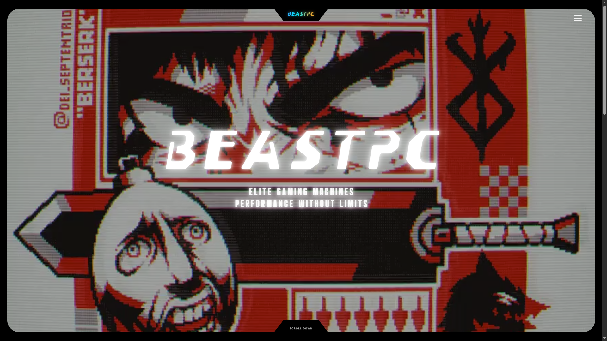
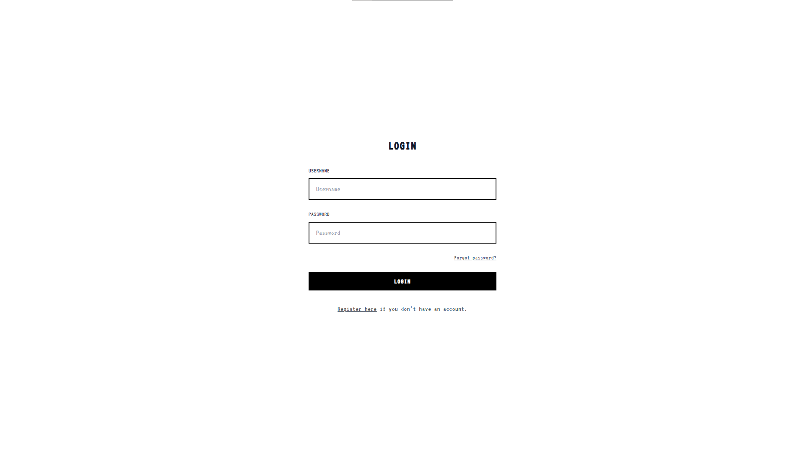
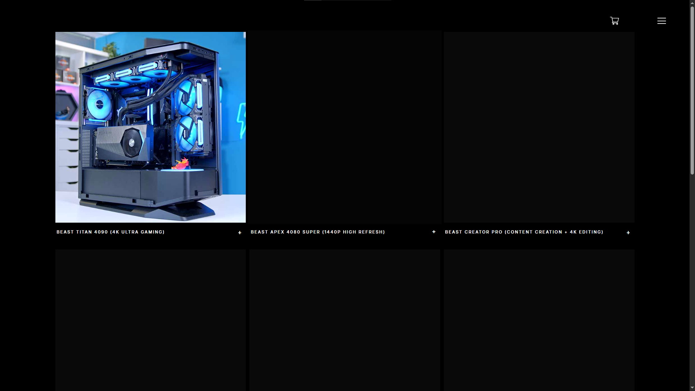
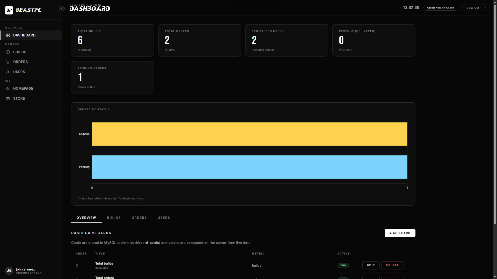

# BeastPC

[](https://dotnet.microsoft.com/)
[](https://learn.microsoft.com/dotnet/csharp/)
[](https://www.mysql.com/)
[](https://angularjs.org/)

**BeastPC** is a full-stack **e-commerce web application** for **ready-to-ship gaming PCs**: catalog, cart, checkout, user accounts, and an admin area for builds and orders. Built as an **ASP.NET MVC / web frameworks** coursework project — clone, run locally, and extend.

**Stack:** ASP.NET MVC · C# · .NET Framework 4.8.1 · MySQL · JavaScript · AngularJS (admin & selected account flows) · Razor views · HTML/CSS

**My role:** MVC structure (controllers, Razor views, routing), MySQL-backed catalog and orders, authentication and email verification, admin dashboard and KPI views, responsive front-end (including large-video hero assets documented in-repo).

**Author:** [johnalvaprojects](https://github.com/johnalvaprojects)

---

## Quick start

1. Open **`BeastPc.sln`** in Visual Studio 2022 (ASP.NET workload, .NET Framework 4.8.1).
2. Create MySQL database `beastpc`, import schema from `BeastPc/App_Data/sql/` (see that folder’s README). Do **not** commit dumps with real customer data.
3. Set the connection string in **`BeastPc/Web.config`** (default XAMPP: `server=127.0.0.1;port=3306;database=beastpc;uid=root;pwd=`).
4. Restore NuGet packages, copy **video** assets into `BeastPc/Content/video/` per `BeastPc/Content/video/README.txt` (large MP4s are gitignored).
5. Set startup project **BeastPc**, press **F5** (often `https://localhost:44301/`).

Before commits, confirm `git status` does **not** list `packages/`, `bin/`, `obj/`, `.vs/`, or `*.mp4` under `Content/video/`.

---

## Features

- Shop catalog with build detail panel and cart
- Checkout and order history (My Account)
- User registration, login, email verification flow
- Admin dashboard: manage PC builds, orders, KPI cards
- Responsive layouts: home, shop, about, contact

## Screenshots

| Home | Login |
|:---:|:---:|
|  |  |

| Shop | Admin dashboard |
|:---:|:---:|
|  |  |

---

## Requirements

- **Windows** with **Visual Studio 2022** (ASP.NET and web development workload)
- **.NET Framework 4.8.1**
- **XAMPP** (or MySQL 8 / MariaDB) on port `3306`
- **HeidiSQL** (optional, for database import)
- **IIS Express** (included with Visual Studio)

---

## Local setup

1. **Clone** this repository and open **`BeastPc.sln`** in Visual Studio (or place the clone under your local web root if you prefer).

2. **MySQL**
   - Start MySQL in XAMPP.
   - Create database `beastpc`.
   - Import a dump from HeidiSQL (**File → Run SQL file**), or run scripts in `BeastPc/App_Data/sql/` for a fresh schema.
   - Do **not** commit SQL exports that contain real customer or payment data.
   - See `BeastPc/App_Data/sql/README.md`.

3. **Connection string** — edit `BeastPc/Web.config` (default XAMPP):

   ```xml
   server=127.0.0.1;port=3306;database=beastpc;uid=root;pwd=;
   ```

   Change `pwd=` if your MySQL root has a password.

4. **NuGet**
   - Right-click the solution → **Restore NuGet Packages** (first time only; `packages/` is not tracked in Git).

5. **Videos (full UI)**
   - Hero and nav backgrounds expect MP4s under `BeastPc/Content/video/`.
   - Large files are **gitignored**; copy them from a full dev machine or add your own clips:
     - `Content/video/videohomepage/` — `vid1.mp4` … `vid4.mp4`, `ultimategamingpc.mp4`
     - `Content/video/navbar/BlackTopoDesktop.mp4`
   - See `BeastPc/Content/video/README.txt`.

6. **Run**
   - Set startup project **BeastPc**.
   - Press **F5** (often `https://localhost:44301/`).

---

## Project layout

| Path | Role |
|------|------|
| `BeastPc/` | MVC app (Controllers, Views, Content, Scripts) |
| `BeastPc/Controllers/BeastPcController.cs` | APIs: builds, orders, auth |
| `BeastPc/Views/Home/` | Shop, checkout, about, contact |
| `BeastPc/Views/Admin/` | Admin dashboard |
| `BeastPc/App_Data/sql/` | SQL migrations |
| `packages/` | NuGet (restore locally; not in Git) |

---

## Contributing

Fork and PR notes, plus optional **first-time GitHub publish** commands, are in **[docs/CONTRIBUTING.md](docs/CONTRIBUTING.md)**.

---

## GitHub profile (for employers)

On the repository home page, use the **About** section (gear icon) for a short description and topics (e.g. `aspnet-mvc`, `csharp`, `mysql`, `ecommerce`, `portfolio`, `web-frameworks`). On your GitHub profile, **Customize your pins** to feature this repository.

---

## License

Licensed under the [MIT License](LICENSE). Use for **coursework, portfolio, and OJT** as allowed by your school or employer.
